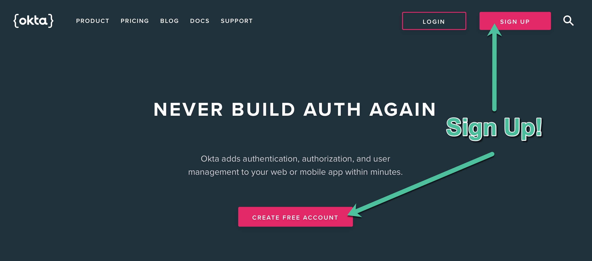
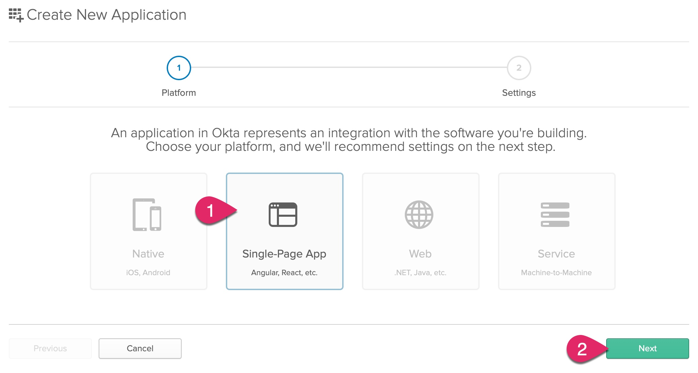
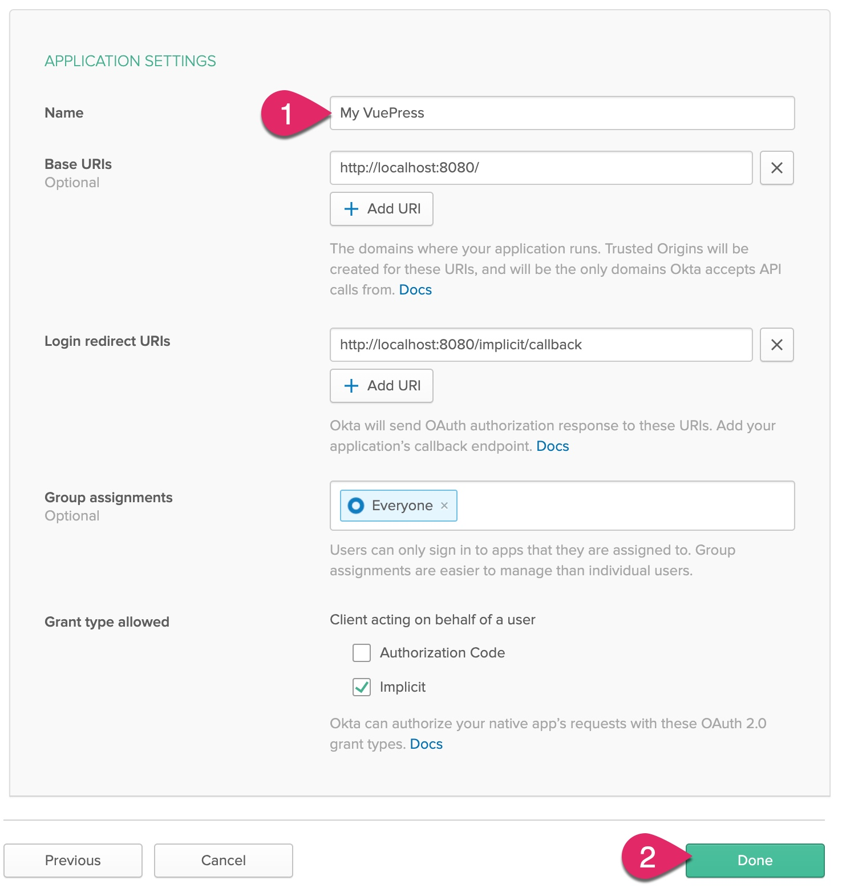
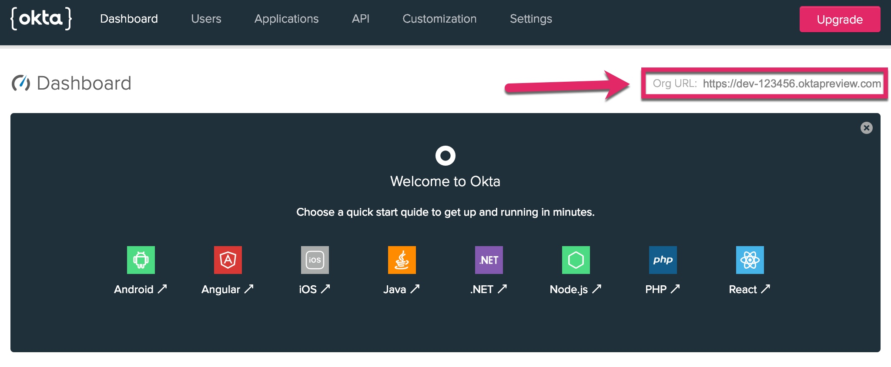
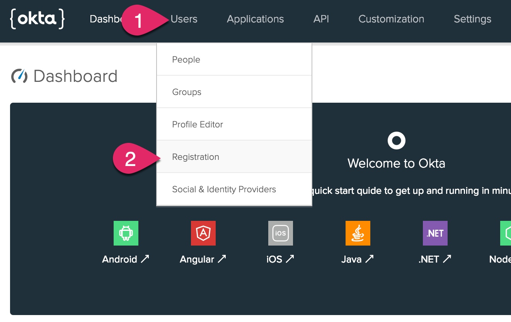
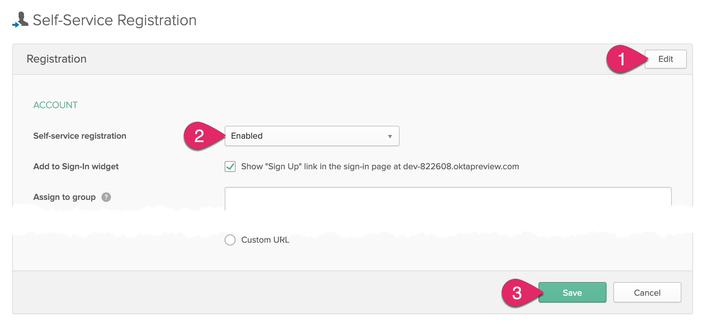
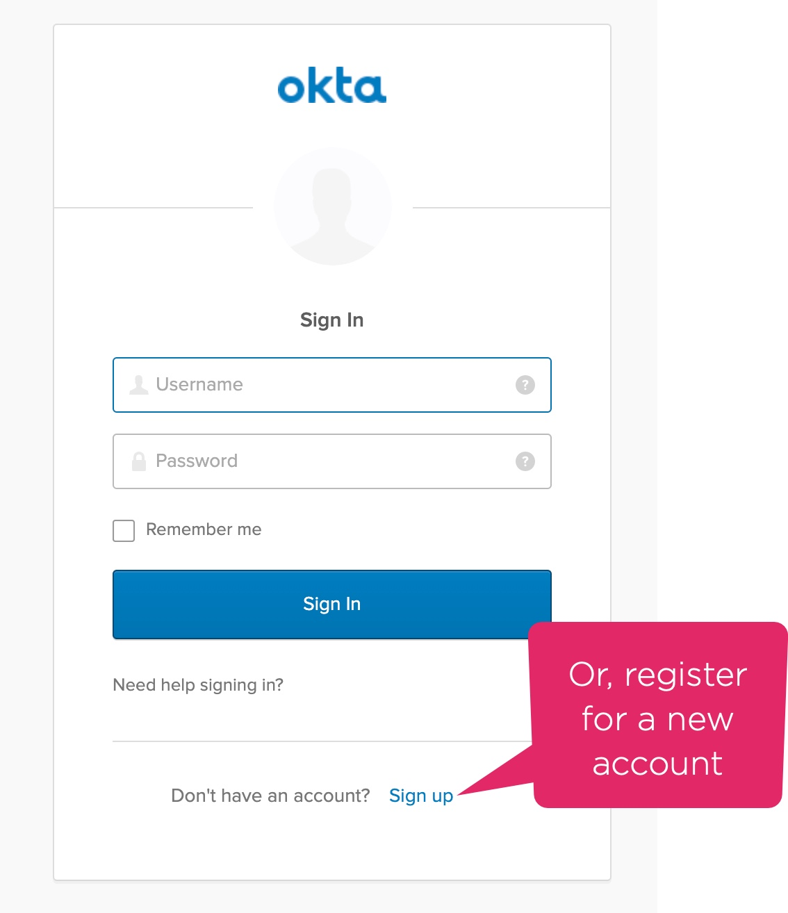
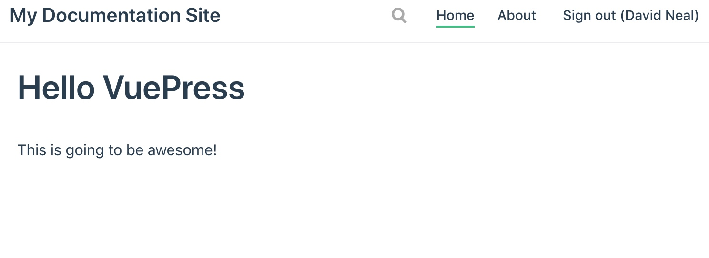
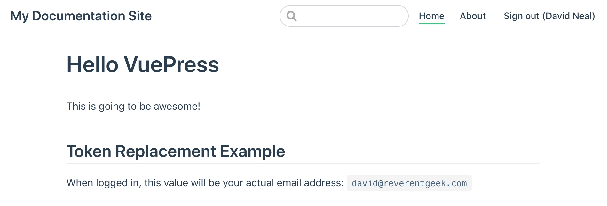

# Add Authentication and Personalization to VuePress

There are several advantages to using a static site generator such as VuePress. With VuePress, you can focus on writing content using markdown, and the VuePress application generates static HTML files. VuePress also turns your content into a single-page application (SPA), so transitions between pages seem instant and seamless. The generated static files can be cached and distributed across a content delivery network (CDN) for even more performance. For the reader, VuePress creates a great experience.

However, a "static" site does not mean you cannot add dynamic touches to your content. In this tutorial, you will learn how to customize VuePress to create a personalized experience based on the person currently viewing the content.

## Install VuePress

> Note: To complete this tutorial, you must have [Node.js](https://nodejs.org) version 8 or higher installed, and a good text/code editor such as [Visual Studio Code](https://code.visualstudio.com/).

The first step is to create a new folder on your computer for the VuePress project. Name it anything you like. VuePress is a command-line interface (CLI) application. Therefore, you will need to open your terminal (macOS or Linux) or command prompt (Windows). Change the current directory at your command line (terminal or command prompt) to the folder you created for the project. Next, use `npm` to initialize this folder.

```bash
npm init -y
```

Now install VuePress using `npm`.

```bash
npm install vuepress@0.14
```

Next, you need to add a couple of commands to the project for running your local VuePress website and building the application. Open your project folder in the code editor of your choice. Edit the `package.json` file and change the section labeled `"scripts"` to the following.

```javascript
  "scripts": {
    "build": "vuepress build .",
    "dev": "vuepress dev ."
  },
```

Create a new file in the project folder named `readme.md`. Open this file and add the following markdown content.

```md
# Hello VuePress

This is going to be awesome!
```

Now run the following command at the command line.

```bash
npm run dev
```

Navigate in your browser to `http://localhost:8080`. You should see something like this screenshot.


You now have a running VuePress application!

One of the excellent features of VuePress is it automatically updates your locally-running application with any changes you make. To demonstrate, leave the development server running at the command line. Make a change to `readme.md` file and save it. When you return to the browser, you should immediately see that change reflected without having to refresh the page!

## Configure VuePress

Much of VuePress is customizable through [configuration](https://vuepress.vuejs.org/config/). In this step, you will configure your VuePress application to add a title and basic navigation.

Create a new folder in the project named `.vuepress`. Notice the period in front of the text, which is required. In the `.vuepress` folder, create a new file named `config.js`.

```javascript
module.exports = {
  title: "My Documentation Site",
  description: "This is going to be awesome!",
  themeConfig: {
    nav: [
      { text: "Home", link: "/" },
      { text: "About", link: "/about/" }
    ]
  }
};
```

Go back to your browser and view `http://localhost:8080`. You should now see an updated header with the title and navigation!


## Add Authentication to VuePress

In the past, adding user login, registration, password reset, and other security features to an application was no trivial task. And, creating application security from scratch also meant potential risk for you or your customers' data. Thankfully, today there are online services like [Okta](https://developer.okta.com) that take the pain and worry out of adding security to your applications.

### Create an Okta Account

The first thing you need to do is create a free [Okta developer account](https://developer.okta.com/).



After creating your account, click the **Applications** link at the top, and then click **Add Application**.


Next, choose a **Single-Page Application** and click **Next**.



Enter a name for your application, such as **My VuePress**. Then, click **Done** to finish creating the application.



Near the bottom of the application page, you will find a section titled **Client Credentials**. Copy the Client ID and paste it somewhere handy. You will need this later.


Click on the **Dashboard** link. On the right side of the page, you should find your Org URL. Copy this value and paste it somewhere handy. You will need this later, too.



Next, enable self-service registration. This will allow new users to create their own account. Click on the **Users** menu and select **Registration**.



1. Click on the **Edit** button.
1. Change Self-service registration to Enabled.
1. Click the **Save** button at the bottom of the form.



### Add the Okta Vue Component to VuePress

To use Okta in your VuePress application, you will need the [Okta Vue](https://www.npmjs.com/package/@okta/okta-vue) component. Go to your command window and run the following command.

```bash
npm install @okta/okta-vue@1.1
```

> Note: If the local development server is still running, you can press **CTRL+C** to stop it.

Create a new file under the `.vuepress` folder named `oktaConfig.js`. Add the following code to this new file.

```javascript
export const oktaConfig = {
    issuer: "https://{yourOktaDomain}/oauth2/default",
    client_id: "{yourClientId}",
    redirect_uri: "http://localhost:8080/implicit/callback/",
    scope: "openid profile email"
};
```

Next, change `{yourOktaDomain}` and `{yourClientId}` to match the Org URL and Client ID you previously copied in the previous steps. Save this file.

### Customize the Default VuePress Theme

To complete the task of adding authentication to your VuePress application, you will need to create a custom theme. One way to do this is to create a copy of the default VuePress theme and modify it.

To create a copy of the default theme, go to your command prompt and type the following command.

```bash
npx vuepress eject .
```

You should now see a new folder under `.vuepress` named `theme`.

You need to modify the page layout to register the Okta Vue component. In the `theme` folder, find the `Layout.vue` file and open it in your editor. Look for the list of statements that begin with the word `import`. Immediately after the last `import` statement, paste the following code, and save the file.

```javascript
import Auth from '@okta/okta-vue';
import {oktaConfig} from '../oktaConfig';

Vue.use(Auth, oktaConfig);
```

Next, create a new folder under `.vuepress` named `components`. In the `components` folder, create a new file named `AuthCallback.vue`. Add the following code to this file.

```javascript
<template>
  <p>Redirecting after login...</p>
</template>

<script>
export default {
  async beforeMount() {
    // Process the auth tokens
    await this.$auth.handleAuthentication();

    // get the redirect path from local storage
    const path = this.$auth.getFromUri();

    // redirect browser to the original page
    window.location.replace( path );
  }
}
</script>
```

Create a new folder in the main project folder named `implicit`. In the `implicit` folder, create a new folder named `callback`. In the `callback` folder, add a new file named `index.md`. Open this file and add the following.

```markdown
# Logging In

<AuthCallback />
```

Next, create a new file under `.vuepress/theme` named `LoginLink.vue`. Paste the following code into this file.

```javascript
<template>
  <div class="nav-item">
    <a
      v-if="authenticated"
      href="/"
      @click.stop.prevent="logout"
      class="nav-link"
    >Sign out ({{ user.name }})</a>
    <a v-else href="/" @click.stop.prevent="login" class="nav-link">Login</a>
  </div>
</template>

<script>
export default {
  created() {
    this.isAuthenticated();
  },
  data() {
    return {
      user: null,
      authenticated: false
    };
  },
  methods: {
    async isAuthenticated() {
      const authenticated = await this.$auth.isAuthenticated();
      if (authenticated) {
        this.user = await this.$auth.getUser();
      } else {
        this.user = null;
      }
      this.authenticated = authenticated;
    },
    login() {
      const currentPath = this.$router.history.current.path;
      this.$auth.loginRedirect(currentPath);
    },
    async logout() {
      await this.$auth.logout();
      await this.isAuthenticated();

      // Navigate back to home
      this.$router.push({ path: '/' });
    }
  }
};
</script>
```

Next, open the `NavLinks.vue` file in the `theme` folder. Make the following changes.

1. In the template, add `<LoginLink />` before the closing `</nav>` tag.
1. Add `import LoginLink from './LoginLink.vue'` to the list of `import` statements.
1. Add `LoginLink` to the list of `components`.

Your code should look similar to the following snippet.

```javascript
      {{ repoLabel }}
      <OutboundLink/>
    </a>
    <LoginLink />
  </nav>
</template>

<script>
import DropdownLink from './DropdownLink.vue'
import { resolveNavLinkItem } from './util'
import NavLink from './NavLink.vue'
import LoginLink from './LoginLink.vue'

export default {
  components: { NavLink, DropdownLink, LoginLink },
```

Now for the moment of truth! Run your dev server again using `npm run dev`, and open your browser to `http://localhost:8080`. You should see a new **Login** link in the navigation!

> Note: If the application shows that you are already logged in, you can test the login process by clicking **Sign out** or by opening a new private/incognito window in your browser.


Clicking on that link should redirect you to the Okta login page for your application. Sign in with your Okta developer account (or test registering a new account with a different email address).



After logging in, you should be redirected back to the application with an updated **Sign out** link with your name.



## Add Personalization to VuePress

There are times when writing documentation that it's necessary to instruct the reader to substitute some value with their own. You witnessed this earlier in this tutorial when you were asked to replace `{yourOktaDomain}` and `{yourClientId}` with your actual account values. Wouldn't it be great to do this for your readers automatically? You can!

In this last step, you will add a library to VuePress to automatically replace a token such as `{email}` with the actual email of the current reader.

In the `.vuepress/theme` folder, add a new file named `tokenReplacer.js`. Open this file and paste the following code.

```javascript
function scanChildNodes(node, results) {
  if (node.childNodes.length) {
    for (let i = 0; i < node.childNodes.length; i++) {
      scanChildNodes(node.childNodes[i], results);
    }
  } else if (node.nodeType == Node.TEXT_NODE) {
    results.push(node);
  }
}
export function getAllTextNodes() {
  const results = [];
  scanChildNodes(document, results);
  return results;
}

export function nodeReplace(nodes, token, value) {
  nodes.forEach(node => {
    node.nodeValue = node.nodeValue.replace(
      new RegExp( `\{${ token }\}`, "gi" ),
      value
    );
  });
}
```

Next, open the `Layout.vue` file. There will be a total of four changes you need to make to this file. First, add the following line to the list of `imports`.

```javascript
import {getAllTextNodes, nodeReplace} from './tokenReplacer'
```

Second, add the following code as the first line inside the `mounted()` function.

```javascript
this.replaceTokens();
```

Third, change the `$router.afterEach()` function to the following:

```javascript
this.$router.afterEach(() => {
  nprogress.done();
  this.isSidebarOpen = false;
  this.replaceTokens();
});
```

Fourth, add the following function to the list of `methods`. Don't forget to add a comma after the `onSWUpdated` method. Here's the new method with `onSWUpdated`, for reference.

```javascript
onSWUpdated (e) {
  this.swUpdateEvent = e
},

replaceTokens() {
  this.$auth.getUser().then( user => {
    if ( user ) {
      const nodes = getAllTextNodes();
      // Look for any occurrence of {yourEmail} and replace it with user's email
      nodeReplace( nodes, "yourEmail", user.email );
    }
  });
}
```

Last, update your `readme.md` to include a couple of tokens.

```markdown
# Hello VuePress

This is going to be awesome!

## Token Replacement Example

When logged in, this value will be your actual email address: `{yourEmail}`
```

Now start your local dev server with `npm run dev` and view `http://localhost:8080`. Before login, you should see something like this.


Log in and observe the value.



Success! You can now move forward with adding support for more tokens.

## Learn More About Vue and Authentication

This post only scratches the surface of what Vue and VuePress can do. Want to learn more? Check out these other great posts!

* [Build a Basic CRUD App with Vue.js and Node](https://developer.okta.com/blog/2018/02/15/build-crud-app-vuejs-node)
* [Add Identity Management to Your Vue.js App](https://developer.okta.com/code/vue/)
* [Add Authentication to Any Web Page in 10 Minutes](https://developer.okta.com/blog/2018/06/08/add-authentication-to-any-web-page-in-10-minutes)
* [What the Heck is OAuth?](https://developer.okta.com/blog/2017/06/21/what-the-heck-is-oauth)

You can find the complete project source code on [GitHub](https://github.com/reverentgeek/vuepress-authentication-tutorial).