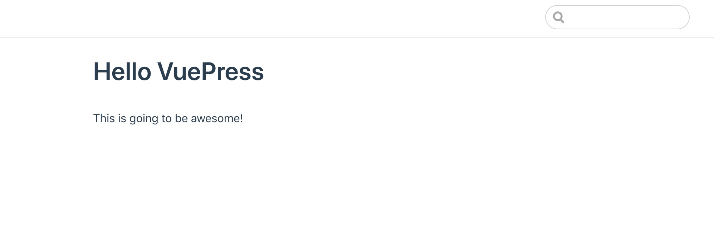

# Add Authentication and Personalization to VuePress

There are several advantages to using a static site generator such as VuePress. With VuePress, you are able to focus on writing content using markdown and the VuePress application generates static HTML files. VuePress also turns your content into a single-page application (SPA), so that transitions between pages seem instant and seamless. The generated static files can be cached and distributed across a content delivery network (CDN) for even more performance. For the reader, VuePress creates a great experience.

However, building a static site does not mean you cannot add personalized touches to your content. In this tutorial, you will learn how to customize VuePress to create a more personalized experience based on the person currently viewing the content.

## Install VuePress

> Note: To complete this tutorial, you must have [Node.js](https://nodejs.org) version 8 or higher installed, and a good text/code editor such as [Visual Studio Code](https://code.visualstudio.com/).

The first step is to create a new folder on your computer for the VuePress project. Name it anything you like. VuePress is a command-line interface (CLI) application. Therefor, you will need to open your terminal (macOS or Linux) or command prompt (Windows). Change the current directory at your command line (terminal or command prompt) to the folder you created for the project. Next, use `npm` to initialize this folder.

```bash
npm init -y
```

Now install VuePress using `npm`.

```bash
npm install vuepress@0.14
```

Next, you need to add a couple of commands to the project for running your local VuePress website and building the application. Open your project folder in the code editor of your choice. Open the `package.json` file. Change the section labeled `"scripts"` to the following.

```javascript
  "scripts": {
    "build": "vuepress build .",
    "dev": "vuepress dev ."
  },
```

Create a new file in the project folder named `readme.md`. Open this file and add the following markdown content.

```md
# Hello VuePress

This is going to be awesome!
```

Now run the following command at the command line.

```bash
npm run dev
```

Navigate in your browser to `http://localhost:8080`. You should see something like this screenshot.



You now have the beginnings of your own VuePress application!